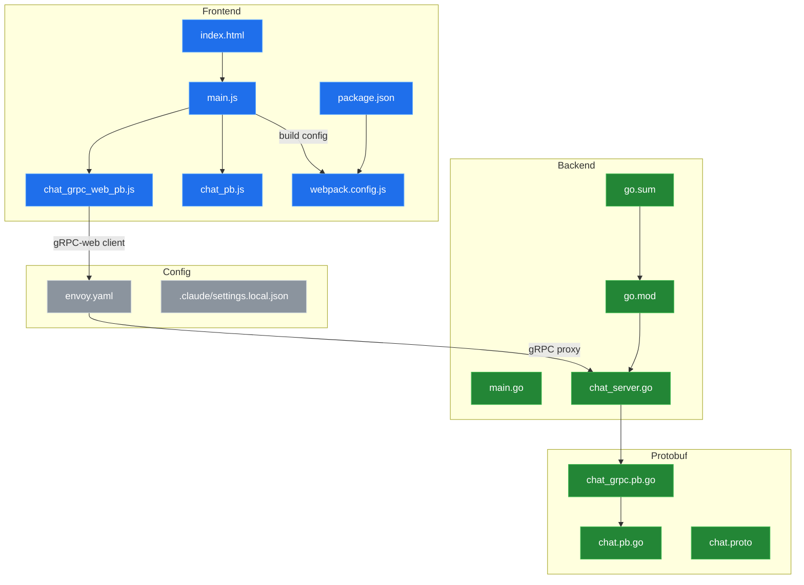
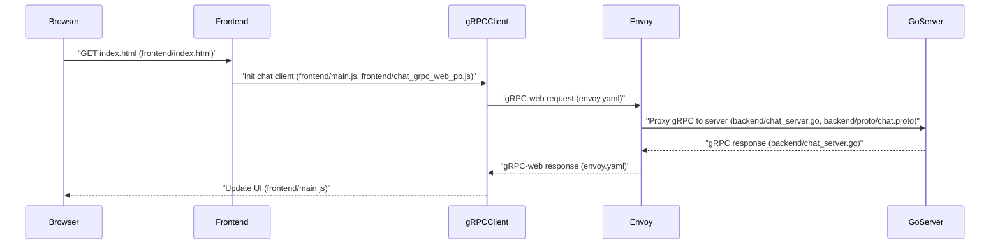

# System Blueprint: YusuffBulbul/Web-Programlama

> Architecture analysis
>
> Auto-generated on 2026-09-04 by Repo-to-Blueprint Architect

## Project Purpose
A web-based chat application implemented with gRPC: frontend assets (HTML/JS and gRPC-web generated clients) and a Go backend implementing a chat service and generated protobuf/gRPC server code. Evidence: frontend/index.html, frontend/main.js, frontend/chat_grpc_web_pb.js, backend/chat_server.go, backend/proto/chat.proto.

## Technical Stack
- **Language**: Go (.go files) and JavaScript (.js, .html)
- **Framework**: Not determinable from provided dependency files — see backend/go.mod and frontend/package.json
- **Key Dependencies**: Not determinable from provided dependency files — see backend/go.mod and frontend/package.json
- **Infrastructure**: Envoy proxy configuration present (envoy.yaml)

## Architecture Blueprint

## Request Flow

## Evidence-Based Risks
1. Generated protobuf artifacts are checked into the repo (frontend/chat_grpc_web_pb.js, frontend/chat_pb.js, backend/proto/chat.pb.go, backend/proto/chat_grpc.pb.go) alongside the source proto (backend/proto/chat.proto) — risk of generated artifacts becoming inconsistent with the .proto source.
2. Frontend build configuration files exist (frontend/package.json, frontend/webpack.config.js) but no frontend lockfile is present in the repository tree (no package-lock.json or yarn.lock shown) — risk of non-reproducible frontend installs/builds.
3. Envoy configuration is present (envoy.yaml) but the repository contains no obvious TLS certificate files (.crt/.pem) or secrets in the file tree — risk: TLS/key material and runtime secrets are not stored here and must be provisioned externally.

---

## Repository Stats
| Metric | Value |
|--------|-------|
| Total Files | 18 |
| Total Directories | 4 |
| Generated | 2026-09-04 |
| Source | [YusuffBulbul/Web-Programlama](https://github.com/YusuffBulbul/Web-Programlama) |

---

*Generated by Repo-to-Blueprint Architect via n8n*
