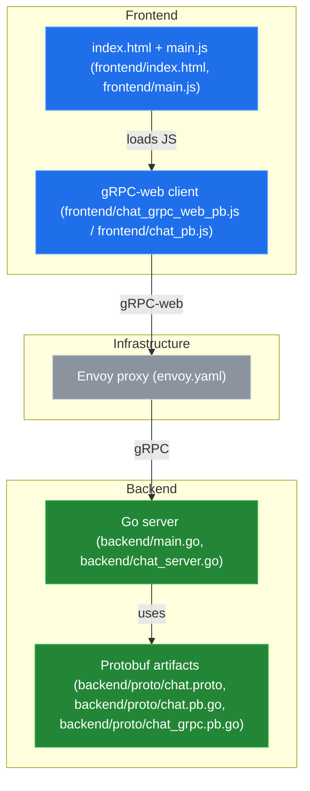
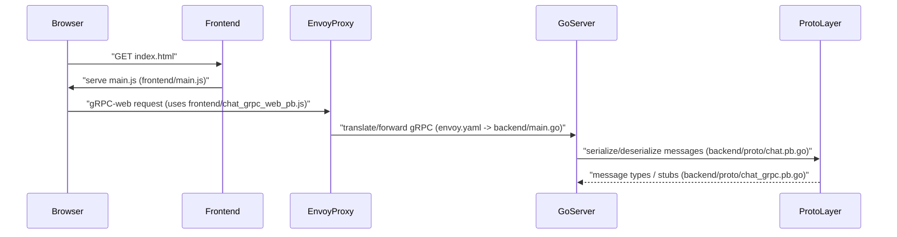

# System Blueprint: YusuffBulbul/Web-Programlama

> Architecture analysis
>
> Auto-generated on 2026-09-04 by Repo-to-Blueprint Architect

## Project Purpose
- Repository contains a Go-based gRPC chat backend and a JavaScript frontend that uses generated gRPC-web client code to interact with it (evidence: backend/main.go, backend/chat_server.go, backend/proto/*.proto / *.pb.go; frontend/index.html, frontend/main.js, frontend/chat_grpc_web_pb.js).

## Technical Stack
- **Language**: Go (.go files) and JavaScript (.js, .html files).
- **Framework**: gRPC / grpc-web (evidence: backend/proto/chat.proto, backend/proto/chat_grpc.pb.go, frontend/chat_grpc_web_pb.js).
- **Key Dependencies**: Declared in backend/go.mod and frontend/package.json (files present: backend/go.mod, frontend/package.json — specific dependency lines not shown in provided evidence).
- **Infrastructure**: Envoy proxy configuration present (envoy.yaml).

## Architecture Blueprint

## Request Flow

## Evidence-Based Risks
1. Generated protobuf artifacts are checked into source control in both frontend and backend (frontend/chat_grpc_web_pb.js, frontend/chat_pb.js, backend/proto/chat.pb.go, backend/proto/chat_grpc.pb.go) — risk of drift and merge conflicts when proto source changes.
2. Single Envoy configuration file exists (envoy.yaml) as the ingress/proxy indicator — central point that must be kept in sync with backend and frontend gRPC endpoints (evidence: envoy.yaml referencing repo gRPC artifacts).
3. Project mixes generated client and server protobuf code plus application code without visible regeneration scripts in the tree (generated files present: frontend/chat_grpc_web_pb.js, backend/proto/*.pb.go; no scripts shown in repository root to regenerate them), increasing maintenance overhead.

---

## Repository Stats
| Metric | Value |
|--------|-------|
| Total Files | 17 |
| Total Directories | 4 |
| Generated | 2026-09-04 |
| Source | [YusuffBulbul/Web-Programlama](https://github.com/YusuffBulbul/Web-Programlama) |

---

*Generated by Repo-to-Blueprint Architect via n8n*
