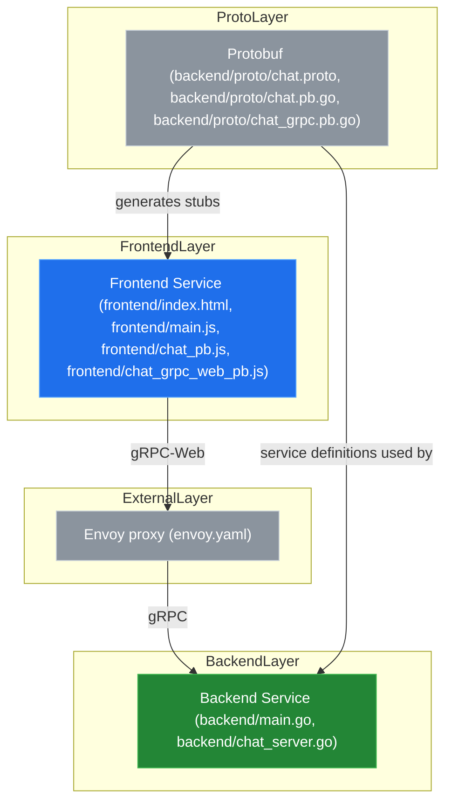
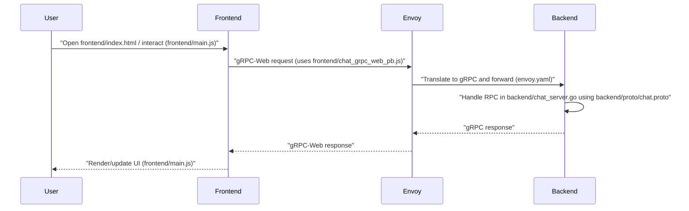

# System Blueprint: YusuffBulbul/Web-Programlama

> Architecture analysis
>
> Auto-generated on 2026-09-04 by Repo-to-Blueprint Architect

## Project Purpose
This repository contains a web chat application implementation with a JavaScript frontend using gRPC-Web stubs and a Go backend exposing gRPC services (protobuf definitions present). Evidence: frontend/index.html, frontend/main.js, frontend/chat_grpc_web_pb.js, backend/main.go, backend/chat_server.go, backend/proto/chat.proto.

## Technical Stack
- **Language**: Go (backend .go files), JavaScript (frontend .js, .html)
- **Framework**: Not declared in parsed dependency files (dependency files present: backend/go.mod, frontend/package.json — contents not shown here)
- **Key Dependencies**: Declared in dependency files backend/go.mod and frontend/package.json (specific libraries not enumerated here because dependency file contents were not provided)
- **Infrastructure**: Envoy proxy config present (envoy.yaml)

## Architecture Blueprint

## Request Flow

## Evidence-Based Risks
1. Committed generated protobuf artifacts are present in the repo (backend/proto/chat.pb.go, backend/proto/chat_grpc.pb.go, frontend/chat_pb.js, frontend/chat_grpc_web_pb.js) alongside the source proto (backend/proto/chat.proto) — risk of generated code and proto drifting or redundant binary/source code in VCS.
2. Envoy configuration exists (envoy.yaml) but there are no deployment manifests or orchestration configs in the repository to show how envoy is run with the services (only envoy.yaml present) — risk: configuration may not be wired to runtime as-is.
3. No test files or test directories detected in the tree (no *_test.go, no frontend test files) and no CI config files present in repository root — risk: changes may not be validated by automated tests in-repo.

---

## Repository Stats
| Metric | Value |
|--------|-------|
| Total Files | 18 |
| Total Directories | 4 |
| Generated | 2026-09-04 |
| Source | [YusuffBulbul/Web-Programlama](https://github.com/YusuffBulbul/Web-Programlama) |

---

*Generated by Repo-to-Blueprint Architect via n8n*
